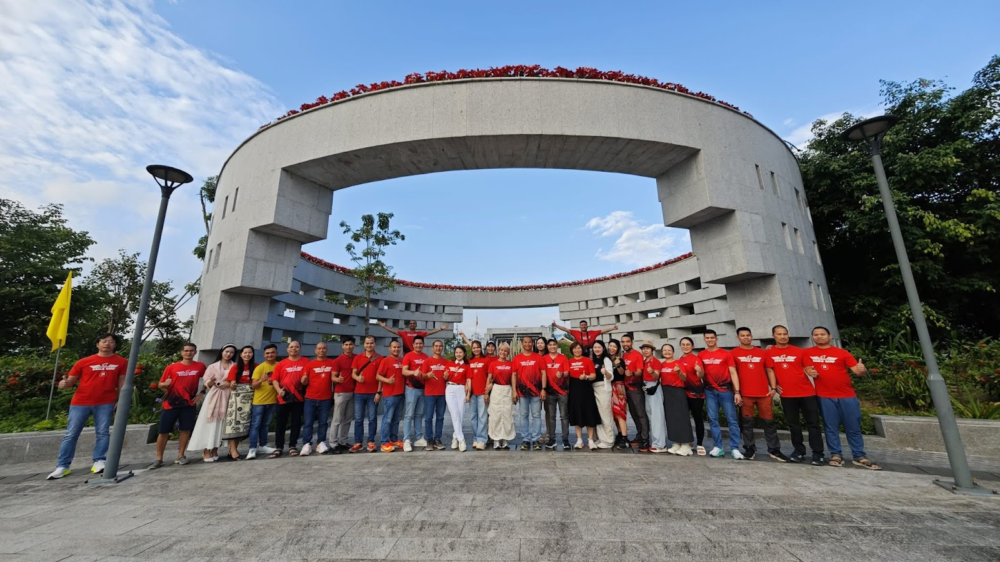
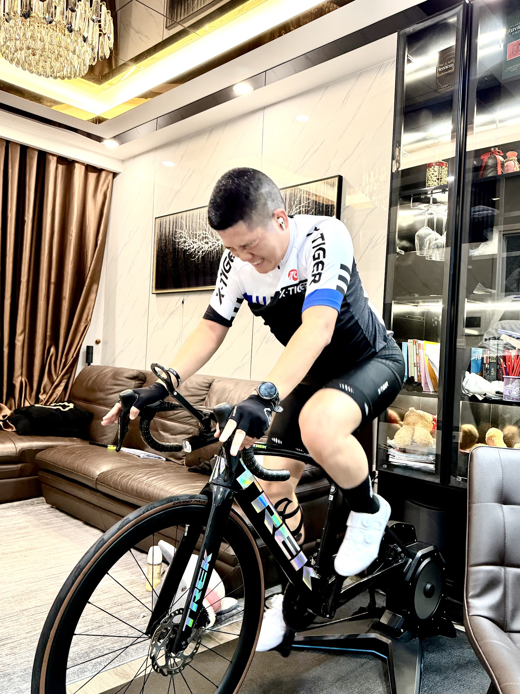
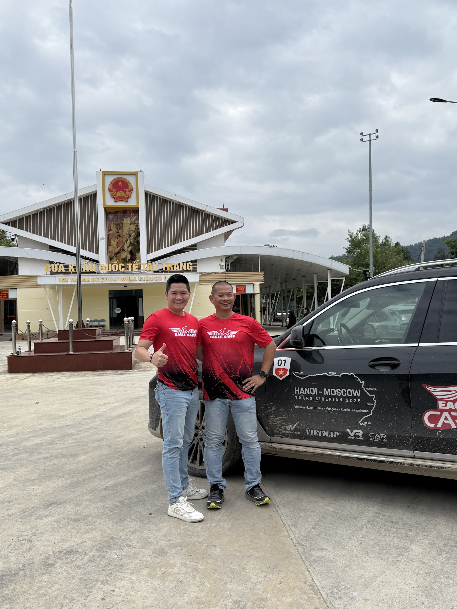
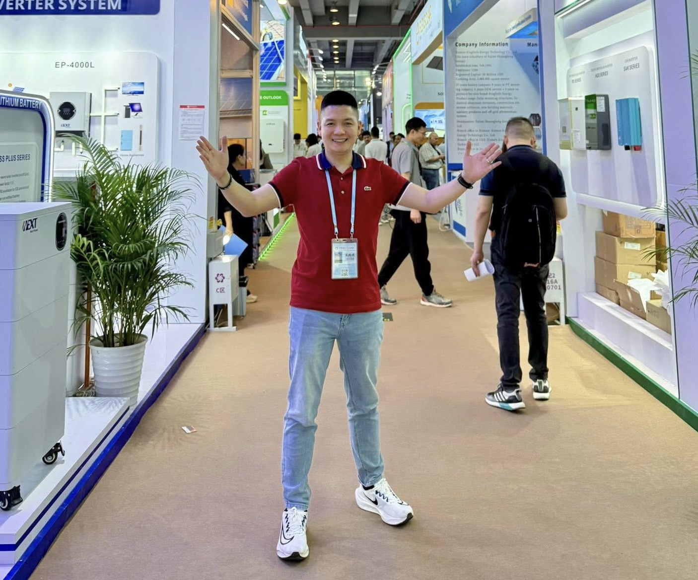
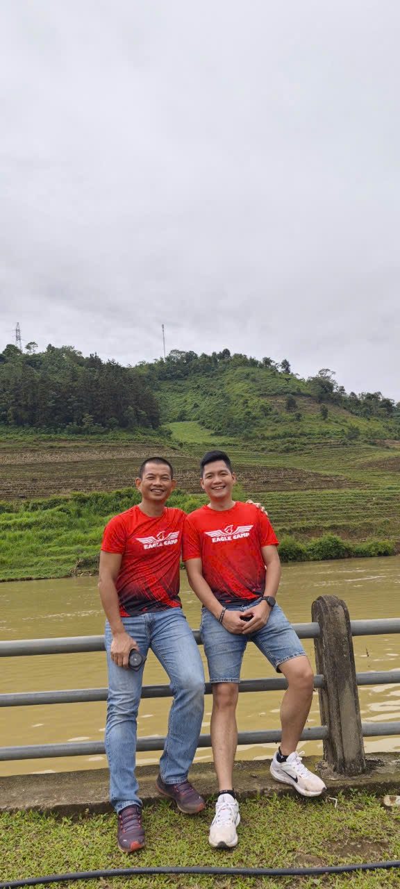

Có những thất bại bạn nhớ rất rõ — vì chúng cùng kiểu. Có những thất bại còn đau hơn — vì chúng **khác kiểu**.

Tôi đã trải qua loại thứ hai. Bốn khóa IPS liên tiếp. Bốn kiểu thất bại khác nhau.

Đây là câu chuyện 5 khóa IPS — và 58 con người tôi gặp ở khóa cuối — đã thay đổi mọi thứ.

## Tại sao tôi học IPS 5 khóa liên tiếp?

Cả đời tôi làm kinh doanh truyền thống. Khi bước sang **kinh doanh online**, mọi thứ với tôi đều lạ lẫm. Tôi gần như không có gì cả về marketing online — không biết viết content, không biết chạy ads, không biết build funnel.

Tôi tìm đến thầy [Phạm Thành Long](https://long.vn/pham-thanh-long-la-ai/) — chuyên gia số 1 Việt Nam về marketing và bán hàng. Khóa **IPS** (Internet Power System) của thầy là khóa flagship — dạy 19 bước build hệ thống marketing online từ A đến Z.

Tôi đăng ký IPS 11. Đó là khóa đầu tiên — và là khởi đầu của một hành trình 4 năm với 5 khóa liên tiếp.

## IPS 11 — "Thấy rất hay, nhưng không biết bắt đầu từ đâu"

Khóa đầu tiên, tôi ngồi trong phòng học với cảm giác **được khai sáng**. Mỗi slide thầy chiếu lên là một insight mới. Mỗi case study là một viên gạch xếp vào hệ tư duy.

Tôi nghĩ:

> *"Wow, mình hiểu rồi. Về nhà mình làm được."*

Về nhà.

Mở laptop.

Ngồi đó.

**Không biết bắt đầu từ đâu.**

19 bước — biết hết. Nhưng bước 1 cần làm gì cụ thể? Mua công cụ nào? Viết content trên platform nào? Setup tracking ra sao?

Tôi loay hoay vài tuần. Sau đó: bỏ ngỏ. Tự thuyết phục mình "Có lẽ chưa đủ kiến thức, học thêm khóa nữa."

## IPS 12 — "Hiểu hơn, làm được 1 chút, rồi bỏ"

Khóa thứ hai. Tôi vào với tâm thế khác — lần này phải làm được.

Lần này tôi hiểu sâu hơn 1 tầng. Tôi setup được fanpage. Viết được vài post. Chạy được mấy ads test nhỏ.

Nhưng kết quả? **Không có gì.**

Likes nhỏ giọt. Comment lác đác. Đơn hàng = 0.

Tôi nghĩ "có lẽ format chưa đúng" — đổi format. "Có lẽ audience chưa đúng" — đổi audience. "Có lẽ sản phẩm sai" — đổi sản phẩm.

Mỗi thay đổi tốn vài tuần. Mỗi tuần không có kết quả. Sau 3 tháng — tôi bỏ.

Khác lần 1: lần 1 *không bắt đầu được*. Lần 2 *bắt đầu được nhưng không có kết quả*.

Cùng đau, khác kiểu.

## IPS 13 — "Học để học, không có định hướng"

Khóa thứ ba. Tôi vào với cảm giác... mệt mỏi.

Tôi thuộc gần hết slide thầy chiếu. Tôi gật đầu khi thầy giảng — "đúng rồi, lần trước tôi cũng làm thế." Nhưng deep down, tôi **không có định hướng rõ ràng** mình muốn build cái gì.

Sản phẩm chính? Chưa chắc.
Audience target? Chung chung.
USP của mình? Không rõ.

Một hệ thống marketing chỉ mạnh khi **có 1 điểm tựa rõ ràng** — sản phẩm + audience + thông điệp. Tôi thiếu cả 3.

Sau IPS 13 — tôi lại bỏ. Không phải vì không học được. **Mà vì tôi học không có đích đến.**

## IPS 14 — "Biết hết cơ bản, nhưng trì hoãn"

Khóa thứ tư. Đến giai đoạn này, tôi đã **biết hết cơ bản**.

19 bước IPS? Thuộc.
5 Way? Hiểu.
30 Tuyệt Chiêu Bán Hàng? Đọc đến lần thứ 5.
Video Marketing 28 Ngày? Có file.

Tôi như một người **chuẩn bị mãi không xuất phát**. Mỗi sáng tôi list ra 10 việc cần làm. Buổi tối làm được 0. Hôm sau lại list — 12 việc. Buổi tối làm được 0.

Trì hoãn không phải vì lười. Trì hoãn vì **lượng việc quá nhiều, đầu óc quá tải, không biết làm trước cái nào**.

Tôi mở 7 tab mỗi sáng: Facebook Ads, TikTok Analytics, Shopee, GA4, Email, Zalo, Instagram. 350 con số trên màn hình. Đầu tê.

Đây là kiểu thất bại đặc biệt — bạn không thiếu kiến thức, không thiếu nỗ lực. **Bạn thiếu một bộ não thứ hai để xử lý lượng thông tin đó.**

## IPS 15 — Khóa thay đổi mọi thứ

Tôi không biết tại sao mình vẫn quyết định đăng ký khóa thứ năm. Có thể vì cảm thấy có nợ với thầy — đã 4 lần rồi, làm sao bỏ giữa được. Có thể vì thâm tâm tôi tin: "Lần này phải khác."

IPS 15 là **Eagle Camp** — một format đặc biệt. Không chỉ học, còn là **cộng đồng**. 58 Eagle khác cùng học với tôi, mỗi người 1 ngành nghề khác nhau:

- Bác sĩ y khoa, bác sĩ răng hàm mặt, bác sĩ chuyên xương khớp
- Founder thương hiệu fashion, mỹ phẩm, dinh dưỡng
- Chủ showroom ô tô đã qua sử dụng
- Coach, luật sư, kiến trúc sư
- Lương y Đông y, founder F&B
- Founder edtech, founder skincare

**58 ngành nghề. 58 câu chuyện. 58 cách áp dụng tư duy IPS vào thực tế.**

Lần đầu tiên trong 4 năm, tôi không học một mình. Tôi học **trong context của 58 con người đang làm thật**.

## Khoảnh khắc thầy nhắc đến Claude

Trong IPS 15, một buổi thầy chia sẻ về **Claude AI** và **Obsidian**.

Tôi không phải người mê công nghệ. Trước đó, tôi đã thử ChatGPT vài lần — kết quả nhạt. Tôi đã từng hỏi "Hôm nay nên đăng caption gì cho fanpage?" và nhận về câu trả lời generic không khớp với business của tôi.

Nhưng cách thầy nói về Claude khác:

> *"Mày đang dùng AI như Google — hỏi thông tin chung. Mày phải dạy nó về business của mày trước. Phải xây cho nó 1 kho não bộ riêng."*

Câu đó dừng tôi lại.

Tôi không cần thêm 1 công cụ nữa. Tôi cần **một bộ não thứ hai** có thể nhận toàn bộ kiến thức 4 năm tôi học, **kết hợp với data thật của business**, và đưa ra quyết định cụ thể.

## Bộ não thứ hai = Claude + Obsidian

Sau IPS 15, tôi build cái mà tôi gọi là **Bộ Não Vận Hành AI**:

- **Lớp 1 — Dữ liệu:** Supermetrics kéo data từ Meta, TikTok, Google, Shopee về 1 chỗ
- **Lớp 2 — Bộ não:** Obsidian vault chứa data + customer + campaign + insight
- **Lớp 3 — Xử lý:** Claude LLM đọc bộ não, phân tích, đưa quyết định
- **Lớp 4 — Hành động:** Quyết định cụ thể, đo được

Lần đầu tiên trong 4 năm, tôi **không loay hoay nữa**.

Mỗi sáng tôi không mở 7 tab. Tôi mở 1 cái Claude — nó đã đọc xong toàn bộ data đêm qua. Nó nói: "Hôm nay 3 việc cần làm: [1], [2], [3]. Lý do: [...]"

Tôi làm. Có kết quả. Tôi feed kết quả ngược lại vào vault. Claude học thêm. Vòng quay tiếp tục.

**Bốn khóa IPS đầu — tôi không biết bắt đầu, không có kết quả, không định hướng, trì hoãn.**

**Khóa IPS 15 — tôi tìm ra con đường.**

Khác biệt không phải ở thầy (vẫn là thầy). Không phải ở khóa học (cùng IPS). Mà ở chỗ tôi tìm ra **cách hệ thống hóa kiến thức** — và **tư duy điều khiển hệ thống** — qua bộ não thứ hai.

## 58 Eagle — và lý do tôi viết chuỗi blog này

Yêu cầu của thầy với khóa Eagle Camp IPS 15 là: **mỗi Eagle viết về các Eagle khác trong lớp**. Backlink chéo. Build hệ sinh thái cá nhân số.

Tôi đang làm việc đó. **70 bài blog** chuẩn SEO, mỗi bài về 1-2 Eagle, áp dụng tư duy IPS + Claude AI cho ngành của họ.

Nhưng không phải vì backlink. Mà vì tôi tin: **nếu áp dụng tư duy marketing số 1 Việt Nam của thầy vào Claude AI — kết quả là combo khủng khiếp** mà chưa ai trong cộng đồng khai thác.

Mỗi Eagle có một moat khác nhau:
- **Trương Văn Trung** (Trung Ô Tô) có chữ tín 12 năm trong ngành xe cũ
- **Đặng Mai Hiền** (Nutrime) có chuyên môn dinh dưỡng và thương hiệu xây
- **Bác sĩ Yến** có hơn chục năm chuyên môn nha khoa
- **Lê Nguyên Trang Nhã** (VIK Fashion) có taste fashion premium
- ... 54 Eagle khác, 54 moat khác

**Một mình mỗi Eagle — đã giỏi.**
**Cộng vào Claude AI — gấp x10, x20, x100 lần.**

## Lời nhắn cho ai đang ở vị trí tôi từng đứng

Nếu bạn đang trong giai đoạn **không biết bắt đầu từ đâu** (IPS 11 của tôi) — bạn không thiếu kiến thức. Bạn cần **1 cấu trúc** để chia kiến thức thành step-by-step.

Nếu bạn đang **làm rồi không có kết quả** (IPS 12 của tôi) — bạn không sai sản phẩm hay audience. Bạn thiếu **một hệ thống đo lường** để biết cái gì work, cái gì không.

Nếu bạn đang **học mãi không có định hướng** (IPS 13 của tôi) — bạn không thiếu khóa học. Bạn cần **1 điểm tựa rõ ràng** — sản phẩm + audience + thông điệp duy nhất.

Nếu bạn đang **biết hết mà trì hoãn** (IPS 14 của tôi) — bạn không thiếu nỗ lực. Bạn cần **bộ não thứ hai** để xử lý lượng thông tin đang choán đầu bạn.

Tất cả 4 vấn đề trên — bộ não AI vận hành **giải quyết được**. Không phải lý thuyết. Là điều tôi đã chứng kiến trong chính 10 ngày qua khi tôi build hệ thống này.

## Workshop miễn phí — chia sẻ cách tôi làm

Nếu bạn cũng là Eagle, hoặc đang trong cộng đồng học của thầy [Phạm Thành Long](https://long.vn/pham-thanh-long-la-ai/), hoặc đơn giản đang loay hoay với marketing online — tôi đang sắp xếp workshop online **miễn phí 90 phút** chia sẻ:

- Cách setup Bộ Não AI cơ bản (Claude + Obsidian)
- Pipeline tự sản xuất content marketing mỗi ngày
- Demo trực tiếp trên data thật

[**Đăng ký workshop tại đây**](/workshop) — số chỗ giới hạn vì tôi muốn đảm bảo Q&A chất lượng.

Hoặc theo dõi tôi tại [trannguyenhoan.com/ket-noi](/ket-noi) — YouTube, TikTok, Facebook đều ở đó.

---

5 khóa IPS. 4 lần thất bại — mỗi lần khác kiểu. 1 lần breakthrough nhờ Claude + Obsidian.

Cảm ơn thầy [Phạm Thành Long](https://long.vn/pham-thanh-long-la-ai/) đã không bỏ tôi sau 4 lần.

Cảm ơn 58 Eagle trong khóa IPS 15 đã làm cộng đồng này có ý nghĩa.

Hẹn các bạn — và 58 đồng đội — trong những bài blog tiếp theo.

— Hoàn (Eagle thứ 59 — IPS 11, 12, 13, 14, 15)
