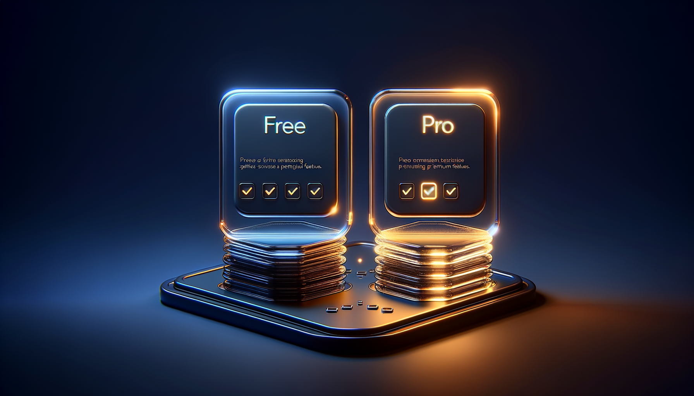

Bạn vừa Google "**Claude desktop**" hoặc "**claude download**" và đến đây.

Có thể bạn đã thử Claude trên web. Có thể bạn nghe ai đó (như tôi nghe [thầy Phạm Thành Long](https://long.vn/pham-thanh-long-la-ai/)) nhắc đến nó. Có thể bạn đang muốn tải về máy để dùng được hiệu quả hơn.

Bạn không một mình. **1,900 người Việt search "claude desktop" mỗi tháng** — và phần lớn vẫn loay hoay không biết cài đúng cách.

Bài này tôi sẽ chỉ bạn từ A-Z: tải, cài đặt, đăng ký, **và quan trọng nhất — cách dùng cho marketing và bán hàng** — không phải dùng Claude như Google.

## Claude Desktop là gì?

**Claude Desktop** là ứng dụng máy tính (desktop app) chính thức của **Anthropic** — công ty tạo ra Claude AI. Bạn cài 1 lần lên máy → mở Claude bằng phím tắt thay vì mở browser → trải nghiệm nhanh hơn, ổn định hơn, và quan trọng nhất: **kết nối được với file local trên máy bạn** (qua MCP — Model Context Protocol).

Claude Desktop khác với Claude.ai (web version) ở 3 điểm:

1. **Tốc độ** — không phải mở tab browser mỗi lần dùng
2. **Tích hợp** — kết nối với Obsidian, file system, terminal qua MCP
3. **Privacy** — conversation lưu local, không sync browser cookies

→ Đây là điểm khiến Claude Desktop trở thành **bộ não thứ hai** thực sự, không chỉ là chatbot trả lời.


## Tại sao bạn nên dùng Claude Desktop thay vì web?

Tôi đã dùng Claude trên web 6 tháng đầu. Sau đó switch sang Desktop. **Khác biệt rõ ràng:**

**1. MCP (Model Context Protocol) — chỉ có trên Desktop**

Đây là tính năng game-changer. Claude Desktop cho phép kết nối với:
- **Obsidian vault** của bạn → Claude đọc toàn bộ kiến thức bạn đã viết
- **File system local** → đọc PDF, docs, CSV không phải copy paste
- **Terminal commands** → chạy script, tự động hóa
- **MCP servers** community (Notion, Google Drive, Gmail...) → unlimited integrations

Trên web Claude.ai: bạn copy paste mọi thứ. Trên Desktop: Claude tự đọc từ máy bạn.

**2. Bàn phím nhanh hơn**

`Cmd+Space` (Mac) hoặc `Ctrl+Alt+C` (Windows) → mở Claude ngay → hỏi → đóng. Không cần mở browser, search tab, đợi load.

**3. Conversation history bền hơn**

Web version đôi khi bị logout, mất history. Desktop lưu local, ổn định.

**4. Nhẹ hơn cho máy yếu**

Browser đôi khi crash khi mở 20 tab. Desktop app native, dùng ít RAM hơn.

→ Nếu bạn nghiêm túc dùng Claude cho công việc — **chuyển sang Desktop**.

## Yêu cầu hệ thống

Claude Desktop hỗ trợ:

| Hệ điều hành | Yêu cầu tối thiểu |
|---|---|
| **Windows** | Windows 10 (64-bit) trở lên |
| **macOS** | macOS 11 (Big Sur) trở lên |
| **Linux** | Chưa có official support 2026 (community workaround) |

**Phần cứng:**
- RAM: 4GB+ (8GB recommended)
- Disk: 500MB cho app, thêm 1-2GB nếu dùng MCP local files
- Internet: cần kết nối khi chat (Claude xử lý trên cloud Anthropic)

## Hướng dẫn tải Claude Desktop từng bước

### Bước 1: Vào trang chính thức của Anthropic

Mở browser → vào: **https://claude.ai/download**

⚠️ **CẢNH BÁO QUAN TRỌNG:** KHÔNG tải Claude từ trang web khác. Có nhiều trang giả mạo phát tán file installer chứa malware. Chỉ tải từ `claude.ai` hoặc `anthropic.com`.

### Bước 2: Chọn phiên bản

Trang download tự động detect hệ điều hành của bạn:
- **Windows** → file `.exe` (~150MB)
- **Mac** → file `.dmg` (~120MB) — chọn Apple Silicon (M1/M2/M3) hoặc Intel tùy máy

Click **Download**.

### Bước 3: Cài đặt

**Windows:**
1. Mở file `.exe` vừa tải
2. Windows Defender có thể hỏi xác nhận → click **Run anyway**
3. Cài đặt mặc định 30 giây xong
4. Claude tự mở sau khi cài

**Mac:**
1. Mở file `.dmg`
2. Kéo Claude.app vào Applications
3. Mở Claude từ Launchpad
4. Lần đầu mở: System sẽ hỏi "Are you sure?" → click **Open**


### Bước 4: Đăng ký tài khoản Claude

Lần đầu mở Claude Desktop, app yêu cầu đăng nhập:

**Option 1 — Đăng ký mới (nếu chưa có account):**
- Click **Sign up**
- Nhập email
- Verify qua email
- Set password

**Option 2 — Đăng nhập (đã có account web):**
- Click **Sign in**
- Login bằng Google / email
- Account web tự sync sang Desktop

Free tier cho phép gửi ~30 messages/5 giờ với Claude Sonnet 4. Nếu sếp dùng nhiều → upgrade Pro $20/m (xem chi tiết trong bài [Claude Pro có đáng $20/m không?](#) — em sẽ link khi viết bài đó).

### Bước 5: Cài MCP server đầu tiên (quan trọng!)

Đây là bước **biến Claude Desktop từ chatbot generic → bộ não thứ hai**.

Vào Settings → Developer → MCP servers. Add MCP server đầu tiên: **Filesystem** (cho phép Claude đọc folder cụ thể trên máy).

Config example trong file `claude_desktop_config.json`:

```json
{
  "mcpServers": {
    "filesystem": {
      "command": "npx",
      "args": ["-y", "@modelcontextprotocol/server-filesystem", "/path/to/your/folder"]
    }
  }
}
```

Restart Claude Desktop → Claude giờ có thể đọc mọi file trong folder bạn cho phép.

→ Tôi connect Claude Desktop với **vault Obsidian** của tôi. Mỗi khi hỏi về business, Claude đã có context toàn bộ kiến thức tôi viết.

## 5 use case dùng Claude Desktop cho marketing

Đây là phần chính. Cài xong Claude là 1 chuyện. **Dùng đúng** cho marketing là chuyện khác.

### Use case 1 — Sản xuất content marketing tự động

Tôi feed Claude:
- Brand voice doc (cách tôi viết)
- Top 20 post Facebook đã engage tốt
- Customer persona detail
- Sản phẩm catalog

Mỗi sáng tôi gõ: "Cho tôi 5 ý tưởng caption FB cho sản phẩm X, target persona Y, tone giống bài #12."

Claude trả về 5 caption — **đúng giọng tôi**, không generic. Nếu không có Desktop + MCP, Claude trả lời chung chung không match brand.

### Use case 2 — Phân tích campaign ads

Claude Desktop kết nối với CSV export từ Meta Ads + TikTok Ads + Google Ads. Tôi gõ:

> "Phân tích ad campaign 30 ngày qua. Tìm 3 angle kéo CPL thấp nhất, 3 angle nên kill."

Claude đọc CSV, tính toán, trả về analysis. Trên web: tôi phải copy paste data — limit độ dài. Trên Desktop: Claude đọc trực tiếp file.

### Use case 3 — Tư vấn khách hàng 24/7 (training pipeline)

Tôi train Claude với:
- 100 cuộc trò chuyện giả định khách hàng
- FAQ + objection handling
- Brand voice + boundaries

Claude trở thành "version digital của tôi" — trả lời inbox như tôi 80% thời gian.

### Use case 4 — Email automation theo trigger

Khi khách đăng ký workshop (qua [trannguyenhoan.com/workshop](/workshop)) → Claude tự sinh 8 emails nurture với context cá nhân hóa theo profile khách. Mỗi email khác giọng tùy persona.

### Use case 5 — Live demo trong sales call

Trong call sales, tôi mở Claude Desktop song song. Khách hỏi câu khó → tôi gõ vào Claude → Claude pull context từ vault → tôi đọc lại → trả lời chuyên nghiệp hơn.

→ Đây là cách [tư duy IPS thầy Phạm Thành Long](https://long.vn/pham-thanh-long-la-ai/) dạy tôi + Claude Desktop = combo khủng khiếp mà tôi đã viết trong bài [3 đêm tôi không ngủ vì Claude](/blog/3-dem-khong-ngu-vi-claude/).

## Combo Claude Desktop + Obsidian = Bộ Não Vận Hành AI

Đây là setup tôi dùng. Đọc thêm [Obsidian là gì + setup vault đầu tiên](#) (em sẽ viết bài Cluster 2.1 sớm).

```
Lớp 1 — Dữ liệu (Supermetrics kéo data từ FB/TikTok/Google)
   ↓
Lớp 2 — Bộ não (Obsidian vault chứa data + customer + campaign)
   ↓
Lớp 3 — Xử lý (Claude Desktop đọc vault qua MCP)
   ↓
Lớp 4 — Hành động (Claude đưa quyết định cụ thể)
```

→ Marketing chạy bằng data, không còn may rủi. Đây là **[Bộ Não Vận Hành AI](#)** mà tôi đang chia sẻ trong [hành trình 5 khóa IPS với thầy](/blog/5-khoa-ips-pham-thanh-long-58-con-nguoi/).


## Claude Desktop free vs Pro: chọn cái nào?

| | Free | Pro ($20/m) |
|---|------|-------------|
| Messages | ~30/5 giờ | ~5x free |
| Models | Claude Sonnet 4 | Sonnet 4 + Opus 4.6 |
| Projects (memory) | Cơ bản | Nâng cao + nhiều projects |
| File upload | Có giới hạn | Không giới hạn |
| Priority support | ❌ | ✅ |

**Em recommend:**
- Mới bắt đầu: **dùng Free** test 1-2 tuần
- Nghiêm túc dùng cho business: **upgrade Pro** ngay sau 1 tuần. $20/m không đáng so với value.



(Tôi sẽ viết bài chi tiết "Claude Pro có đáng $20/m không? Trải nghiệm Eagle 1 năm" — link khi xong.)

## Câu hỏi thường gặp

**Claude Desktop có miễn phí không?**
App miễn phí. Nhưng Claude AI bên trong có free tier (~30 msg/5h) và Pro $20/m. Tải app không tốn tiền, dùng AI nhiều thì cần upgrade.

**Claude Desktop có tiếng Việt không?**
Interface app bằng tiếng Anh, nhưng bạn **chat bằng tiếng Việt thoải mái**. Claude hiểu tiếng Việt rất tốt — chuẩn không cần chỉnh.

**Tôi có thể dùng Claude Desktop offline không?**
Không. Cần kết nối internet vì Claude xử lý trên cloud Anthropic. Chỉ MCP local files đọc offline được.

**Có Claude Desktop cho điện thoại không?**
Hiện tại Claude có app Android + iOS — riêng biệt. Bài này tập trung Desktop (Windows/Mac).

**Claude Code khác Claude Desktop như thế nào?**
Claude Code là CLI tool cho developer (chạy trong terminal). Claude Desktop là GUI cho mọi người. Bạn có thể dùng cả 2.

**Tôi cần trải qua gì trước khi dùng Claude Desktop hiệu quả?**
Tôi đã trải qua [4 lần thất bại trước khi tìm ra con đường](/blog/5-khoa-ips-pham-thanh-long-58-con-nguoi/) — mỗi lần kẹt 1 chỗ khác nhau. Đến IPS 15, kết hợp Claude Desktop + tư duy thầy Phạm Thành Long, mọi thứ đổi.

## Kết — sau khi cài Claude Desktop, làm gì tiếp?

Cài Claude Desktop là bước 1. Bước 2 mới quan trọng: **biết cách feed nó đúng data + dùng đúng tư duy**.

Tôi đã chứng kiến nhiều người cài Claude rồi để đó vì không biết bắt đầu. Đây cũng chính là [vấn đề tôi gặp ở khóa IPS đầu tiên với thầy](/blog/5-khoa-ips-pham-thanh-long-58-con-nguoi/) — biết tool, không biết áp dụng.

Tôi đang sắp xếp **workshop online MIỄN PHÍ 90 phút** chia sẻ:
- Setup Claude Desktop + Obsidian + MCP integration (live demo trên máy tôi)
- Pipeline tự sản xuất content marketing 30 phút/ngày
- Demo apply tư duy IPS của thầy Phạm Thành Long vào prompt Claude
- Q&A trực tiếp về case của bạn

[**Đăng ký workshop tại đây**](/workshop) — số chỗ giới hạn 100 người để Q&A chất lượng.

Hoặc theo dõi tôi tại [trannguyenhoan.com/ket-noi](/ket-noi) — YouTube/TikTok/Facebook đều ở đó.

---

Cảm ơn bạn đã đọc đến đây. Nếu bài hữu ích — share cho 1 người bạn đang cần. Nếu có câu hỏi cụ thể về setup Claude Desktop hoặc combo với Obsidian — comment hoặc inbox tôi qua [Fanpage](https://www.facebook.com/hoanclaude/).

Hẹn bạn ở bài tiếp theo: [Obsidian là gì? Hướng dẫn từ A-Z cho chủ shop VN](#) — em đang viết.

— Hoàn (Eagle thứ 59 — học trò [thầy Phạm Thành Long](https://long.vn/pham-thanh-long-la-ai/))
