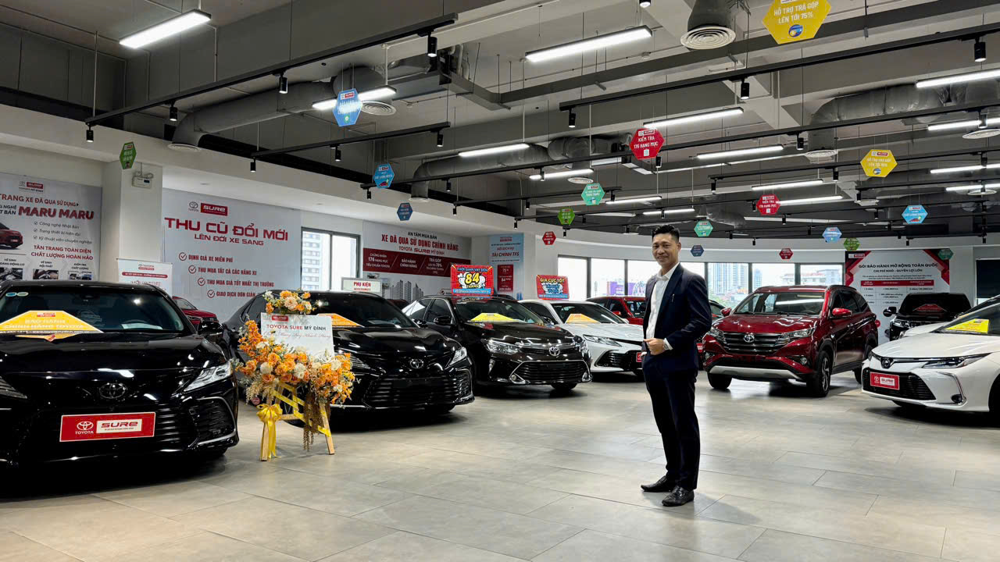
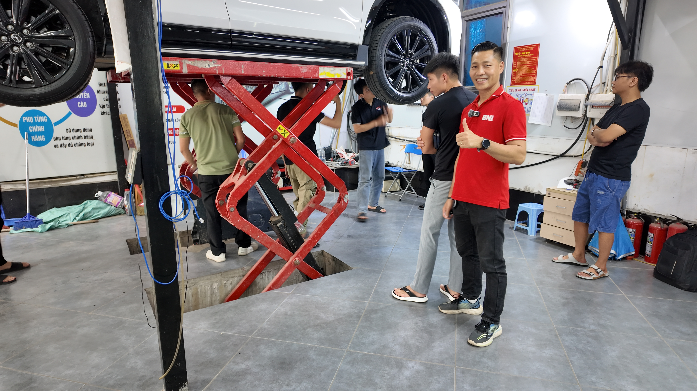

Trong 58 Eagle khoá IPS15 cùng tôi học thầy [Phạm Thành Long](https://long.vn/pham-thanh-long-la-ai/), có một người làm nghề tưởng chừng "không có chỗ cho AI" — nhưng câu chuyện của anh ấy lại làm tôi suy nghĩ rất nhiều về **chữ tín** trong thời đại số.

Đó là **[Trương Văn Trung](https://trungoto.vn/truong-van-trung-la-ai/)** — chủ thương hiệu **Trung Ô Tô** tại Hà Nội.

## Trương Văn Trung là ai?

Anh là **nhà sáng lập và người điều hành** thương hiệu Trung Ô Tô — một showroom chuyên kinh doanh **ô tô đã qua sử dụng** tại **237 Nguyễn Xiển, quận Thanh Xuân, Hà Nội**. Đây không chỉ là nơi kinh doanh, mà còn là nơi anh trực tiếp gặp gỡ khách hàng, tư vấn từng trường hợp cụ thể và **chịu trách nhiệm đến cùng** với mỗi chiếc xe được bán ra.

Trung Ô Tô không chọn con đường xây dựng thương hiệu bằng hình ảnh hào nhoáng. Anh chọn cách khó hơn: **xây uy tín qua từng giao dịch thực tế**.

## Hành trình 12 năm trong nghề ô tô cũ

Đây là phần làm tôi tôn trọng anh Trung nhất.

**2016 – 2022:** Anh giữ vị trí **Trưởng phòng điều hành xe đã qua sử dụng tại Toyota Mỹ Đình** — môi trường doanh nghiệp lớn, tiêu chuẩn nghiêm ngặt. 6 năm trong môi trường top-tier không phải ai cũng trụ được.

**Sau 2022:** Anh tự ra build thương hiệu riêng — Trung Ô Tô. Mang theo toàn bộ kiến thức kỹ thuật, pháp lý xe và mạng lưới khách hàng tích lũy từ Toyota.

**Tổng cộng:** Hơn **12 năm thực chiến** trong lĩnh vực ô tô đã qua sử dụng. Đây không phải con số trên CV — đây là 12 năm trực tiếp tiếp xúc với xe và con người.

**2023:** Anh tham gia **BNI** — mạng lưới doanh nhân chuyên nghiệp toàn cầu. Mở rộng vai trò kết nối và phát triển cộng đồng kinh doanh.

**2024:** Anh hoàn thành **2 cự ly Marathon 42km**. Đây không phải thông tin lifestyle — đây là dấu hiệu của **kỷ luật, sức bền và ý chí vượt giới hạn** mà anh áp dụng vào cả công việc và cuộc sống.

## Trung Ô Tô làm gì cụ thể?

Anh tập trung vào **dòng xe từ 4 đến 16 chỗ**, phục vụ 3 nhóm khách hàng rõ ràng:

- **Cá nhân và gia đình mua xe lần đầu** — cần tư vấn kỹ lưỡng, dễ hiểu
- **Doanh nhân, chủ doanh nghiệp** — cần xe phục vụ công việc và hình ảnh cá nhân
- **Khách đổi xe, nâng cấp** — tối ưu chi phí khi mua xe cũ

Công việc của Trung Ô Tô **không dừng lại ở mua – bán xe**. Anh handle toàn bộ chuỗi giá trị:

1. **Kiểm tra kỹ thuật tổng thể**: động cơ, khung gầm, hộp số, hệ thống an toàn, nội – ngoại thất
2. **Rà soát lịch sử và pháp lý xe** — đảm bảo minh bạch, không xe tai nạn ẩn, không thủy kích, không pháp lý mờ
3. **Định giá theo tình trạng thực tế** — không chạy theo giá ảo thị trường
4. **Tư vấn chọn xe phù hợp** với mục đích sử dụng, ngân sách và kế hoạch dài hạn

Có một câu trong bio Trung làm tôi dừng lại đọc 3 lần:

> *"Nếu chiếc xe đó không phù hợp, Trung Ô Tô sẵn sàng nói không."*

Trong thời đại "bán bằng mọi giá", một người sẵn sàng từ chối deal vì khách hàng không phù hợp với chiếc xe — đây là phẩm chất hiếm. Đây là chữ tín được xây không bằng lời nói, mà bằng từng quyết định khó khăn.

## Câu chuyện cá nhân — không phải con đường trải sẵn

Anh Trung đến với nghề ô tô không phải bằng con đường trải sẵn. **Những năm đầu là chuỗi ngày va vấp, thử – sai và trả giá**. Đã từng có những quyết định mua xe khi chưa đủ kinh nghiệm — gây tổn thất tài chính và áp lực tinh thần lớn.

Chính những khó khăn đó buộc anh phải:

- Học sâu hơn về kỹ thuật, pháp lý và thị trường
- Làm nghề với sự cẩn trọng cao nhất
- Luôn đặt mình vào vị trí khách hàng trước mỗi quyết định

Bài học lớn nhất anh rút ra:

> *Kinh doanh ô tô cũ không cho phép làm ẩu. Một sai lầm nhỏ có thể ảnh hưởng lớn đến tài chính và cuộc sống của người mua xe. Vì vậy, chữ tín không phải là khẩu hiệu, mà là điều kiện sống còn.*

Đây là tư duy mà tôi nghĩ **rất nhiều người làm marketing online cần học lại**.

## Giá trị Trung Ô Tô mang lại

Trong hơn 12 năm, anh đã trực tiếp hỗ trợ và tư vấn cho **hàng nghìn khách hàng** trên thị trường ô tô cũ. Cụ thể:

- **Giúp khách tránh mua phải** xe tai nạn, xe thủy kích, xe pháp lý không rõ ràng
- **Giúp gia đình và doanh nhân** chọn xe đúng nhu cầu — không mua thừa, không mua thiếu
- **Giúp người mua lần đầu** hiểu rõ thị trường — tránh bị dẫn dắt bởi quảng cáo thiếu trung thực

Phần lớn khách hàng đến với anh Trung mang tâm lý **lo lắng, thiếu kiến thức, sợ rủi ro**. Sau khi làm việc cùng — họ hiểu rõ chiếc xe mình mua, **tự tin sử dụng**, và sẵn sàng giới thiệu thêm người thân, bạn bè.

Sự giới thiệu đó chính là minh chứng rõ nhất cho hiệu quả và uy tín của Trung Ô Tô.

## Khi tư duy IPS gặp chữ tín 12 năm — và Claude AI

Đây là phần tôi muốn thảo luận với anh Trung — và với tất cả Eagle ngành ô tô khác trong cộng đồng IPS thầy Long.

Anh có một thứ mà 90% showroom xe cũ tại Việt Nam **không có**: chữ tín được build trong 12 năm. Đây là **moat** (hào nước phòng thủ) cực mạnh.

Nhưng có một bài toán lớn: **chữ tín không scale được dễ.**

Anh nói "không" với 1 khách hàng không phù hợp = 1 quyết định.
Anh nói "không" với 100 khách = 100 quyết định, mỗi cái cần thời gian phân tích.
Anh nói "không" với 1000 khách = không khả thi nếu chỉ có 1 anh + đội ngũ truyền thống.

Đây chính là điểm mà **Claude AI bước vào** — không thay thế chữ tín, mà **scale chữ tín**.

### 5 cách Claude AI có thể giúp Trung Ô Tô (và bất kỳ Eagle nào ngành ô tô cũ)

**1. AI Pre-Qualification Tool**

Khách inbox "Còn xe Innova 2018 không?" — Claude phân tích context (giá khách hỏi, mục đích sử dụng, ngân sách) → tự động đánh giá *xe đó có phù hợp với khách đó không* trước khi anh tốn thời gian tư vấn. Nếu không phù hợp, Claude soft-decline + đề xuất xe khác — vẫn giữ chữ tín, không spam.

**2. AI Vehicle History Researcher**

Mỗi xe cũ có 1 lịch sử — đăng kiểm, biển số, vùng đăng ký, tai nạn (nếu có). Claude tự crawl + tổng hợp lịch sử xe từ nhiều nguồn (đăng kiểm, bảo hiểm, mạng xã hội, diễn đàn ô tô) → ra báo cáo trong vài phút thay vì vài giờ.

**3. AI Damage Assessment từ Ảnh**

Khách gửi 10 ảnh xe đang muốn bán cho Trung Ô Tô. Claude (vision) phân tích ảnh → đánh dấu vùng nghi vấn (sơn lại, móp ẩn, đèn không đồng bộ) → ra prediction về tình trạng xe trước khi anh ra hiện trường thẩm định.

**4. AI Personalized Buyer Education**

Khách lần đầu mua xe lo lắng. Anh không thể ngồi viết email 30 phút giải thích cho từng người. Claude generate **bộ giáo trình mua xe cá nhân hóa** theo profile khách: tuổi, ngân sách, gia đình, mục đích → giúp khách hiểu rõ trước khi đến showroom.

**5. AI Customer Lifetime Tracking**

Mỗi khách đã mua xe của anh — Claude track:
- Khi nào nên bảo dưỡng (theo loại xe + km)
- Khi nào có thể upgrade (sau 18-24 tháng)
- Sinh nhật khách → SMS chúc mừng cá nhân hóa
- Mùa nắng → tip bảo quản xe

→ Mỗi khách hàng cũ trở thành nguồn referral lâu dài.

## Khi nghề tử tế gặp công cụ đỉnh cao

Tôi tin một điều: **AI không tạo ra chữ tín**. Nhưng AI có thể **giữ chữ tín đó vận hành được ở quy mô lớn**.

Anh Trung đã build chữ tín 12 năm bằng cách làm thật. Nếu anh quyết định build bộ não AI cho Trung Ô Tô — combo tư duy IPS thầy Long + Claude AI — tôi tin anh có thể:

- Phục vụ **5x số khách** mà không mất chất lượng tư vấn
- Đào tạo team mới **nhanh hơn 10x** vì kiến thức của anh nằm trong vault, AI dạy lại
- Marketing **ít tốn ngân sách** vì content cá nhân hóa cho từng phân khúc
- Build **moat lớn hơn** so với showroom truyền thống không dùng AI

Đây không phải lý thuyết. Đây là điều tôi vừa chứng kiến trong 10 ngày qua khi tôi build bộ não AI cho chính mình — và đêm qua khám phá thêm các tính năng ẩn đến 8h sáng.

## Lời nhắn từ 1 Eagle đến 1 Eagle khác

Anh Trung — nếu anh đọc đến đây — em viết bài này không phải để bán hàng. Em viết vì em thấy ngành ô tô cũ tại Việt Nam đang ở giai đoạn cực kỳ thú vị.

Có những showroom đang **scale bằng cách bỏ chữ tín** — bán nhanh, bán nhiều, sẵn sàng "đẩy" xe không phù hợp. Họ thắng ngắn hạn.

Có những showroom như anh — **scale bằng chữ tín** — chậm hơn, khó hơn, nhưng đi xa hơn.

Em tin anh và Claude AI hợp nhau hơn anh nghĩ. Em sẵn sàng chia sẻ framework — không tốn 1 đồng — vì em là Eagle giống anh, học cùng thầy Long.

Châm ngôn anh viết trong bio thực sự đáng để mọi Eagle suy ngẫm:

> *Làm nghề không phải để đi nhanh, mà để đi xa.*

## Câu hỏi thường gặp

**Trung Ô Tô có địa chỉ ở đâu?**
Showroom Trung Ô Tô tại **237 Nguyễn Xiển, quận Thanh Xuân, Hà Nội**. Đây cũng là nơi anh Trương Văn Trung trực tiếp gặp khách và thẩm định xe.

**Trung Ô Tô bán xe mới hay xe cũ?**
Trung Ô Tô **chuyên xe đã qua sử dụng** (xe cũ), tập trung vào dòng 4-16 chỗ.

**Trương Văn Trung có kinh nghiệm bao lâu?**
**Hơn 12 năm** trong nghề ô tô cũ, trong đó 6 năm (2016-2022) làm Trưởng phòng tại **Toyota Mỹ Đình**.

**Trung Ô Tô khác gì các showroom xe cũ khác?**
Triết lý "**sẵn sàng nói không**" với xe không phù hợp khách. Tập trung minh bạch, kiểm tra kỹ thuật + pháp lý đầy đủ trước khi tư vấn.

**Có thể liên hệ Trương Văn Trung như thế nào?**
Anh có trang giới thiệu cá nhân tại [trungoto.vn/truong-van-trung-la-ai](https://trungoto.vn/truong-van-trung-la-ai/) và website thương hiệu tại [trungoto.vn](https://trungoto.vn/).

---

Cảm ơn anh **[Trương Văn Trung](https://trungoto.vn/truong-van-trung-la-ai/)** đã là một phần trong hành trình IPS15. Hẹn anh trong những buổi coffee và Marathon tới — em cũng đang muốn tập chạy, có lẽ anh dạy em được vài thứ.

Đọc thêm bài về hành trình của em trên [trannguyenhoan.com/about](/about) hoặc kết nối với em qua [trannguyenhoan.com/ket-noi](/ket-noi).

— Hoàn (Eagle thứ 59)
